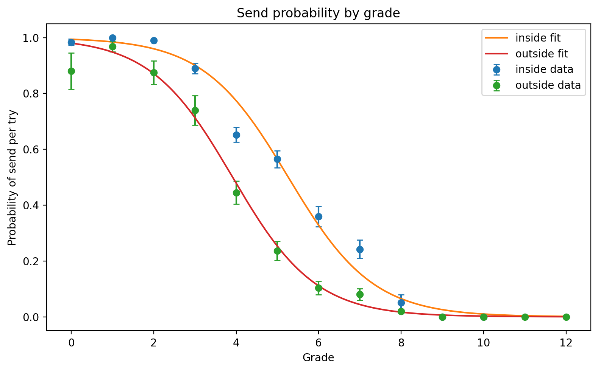
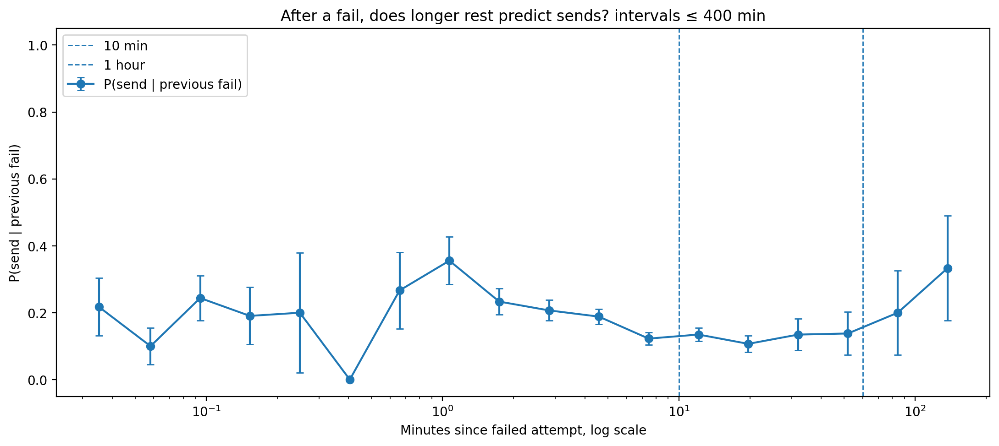
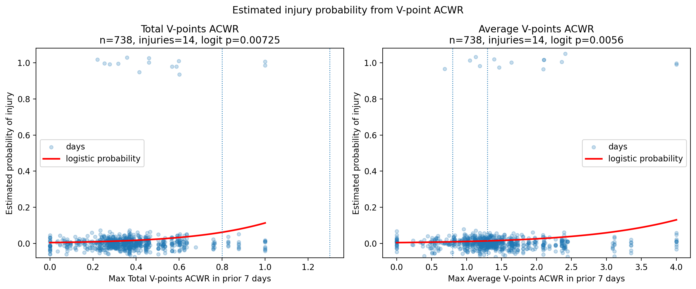

Basic idea is to record failures and sucesses when climbing. Plus a handy timer between attempts!

**Side Quests:**

- Predict Injuries?
- Predict Climbing Well?
- Profit???

**Future Work:**

Only works on android :[ someone with a bunch of tokens (not me) should translate it to a cross platform version.
Also, If you collect a bunch of data I'd love to have it! Plus i'm giving you mine so...... 

**P.S.**

the thing most correlated with climbing well is climbing. The thing most correlated with climbing more is having fun while climbing.

# WARNING: AI SLOP

**This README is fully AI-generated right now. The app and models are about 60%
AI-generated.**

# Climbs

Climbs is an Android training log for recording individual climbing attempts,
hangs, pulls, injuries, bodyweight, and perceived status. It combines a detailed
attempt history with load, grade, ACWR, and training-volume charts.

The core idea is simple: **record every genuine attempt**, whether it succeeds or
fails. Consistent recording makes the send-rate, grade, and workload trends much
more meaningful.

[Download the full PDF user guide](output/pdf/climbs_user_guide.pdf)

[Read the climbing model results summary](output/pdf/climbing_model_results_summary.pdf)

[Download the Android APK](app-debug.apk?raw=1)

## Contents

- [Model highlights](#model-highlights)
- [Recording philosophy](#recording-philosophy)
- [Features](#features)
- [Recording training](#recording-training)
- [Navigating the app](#navigating-the-app)
- [Metrics](#metrics)
- [Model results and methodology](#model-results-and-methodology)
- [Charts](#charts)
- [Events](#events)
- [Export and backup](#export-and-backup)
- [Installing the app](#installing-the-app)
- [Building from the command line](#building-from-the-command-line)
- [Technical details](#technical-details)

## Model highlights

The modeling results below summarize this recorded dataset. They are useful for
describing patterns and generating training questions, but they do not establish
causation or guarantee that the same relationships apply to another climber.
See the [Climbing Model Results Summary](output/pdf/climbing_model_results_summary.pdf)
for the complete analysis, statistical tests, and limitations.

### Send probability by grade and venue



*Observed send fractions with fitted logistic send-probability curves. Error
bars show uncertainty in the observed grade-level proportions.*

- Send probability decreases as grade increases for both venues.
- The indoor fitted curve is shifted roughly one V-grade to the right of the
  outdoor curve. In this dataset, an indoor climb therefore has a higher fitted
  send probability than an outdoor climb with the same nominal grade.
- Later performance and surprise models use venue-specific probability fits so
  they do not treat the same indoor and outdoor grade as equally difficult.

### Rest after a failed attempt



*Observed probability that the next attempt is a send after a failure, grouped
by elapsed time. The horizontal axis is logarithmic; error bars widen where
there are fewer observations.*

- Waiting longer within the short-rest range does not show a clear improvement
  in next-attempt send probability.
- In particular, the data do not support treating rests shorter than roughly
  10-11 minutes as a send-probability booster.
- Long intervals are sparse and can represent session breaks or different
  climbing days rather than ordinary between-attempt rest.
- This is observational. Grade, fatigue, tactics, route choice, and the reason
  for resting can all affect both rest duration and the next result.

### ACWR and recorded injury prediction



*Logistic estimates for recorded injury dates using the maximum Total or Mean
V-point ACWR during the prior seven days. The analysis contains 738 evaluated
days and 14 recorded injury dates.*

- Higher Total V-point ACWR and Mean V-point ACWR are associated with recorded
  injury dates in these univariate models (`p = 0.00725` and `p = 0.0056`).
- Injury and non-injury days overlap substantially. High ACWR is not equivalent
  to certain injury, and fitted absolute injury probability remains well below
  50% across the observed range.
- With only 14 injury dates, false positives and model instability remain
  important concerns.
- ACWR is best treated as a workload and risk marker, not a diagnosis, safety
  threshold, or instruction to pursue a particular ratio.

## Recording philosophy

Create one climb record whenever you start a climb intending to complete it
under your normal send standard.

A **failure** is an attempt that does not meet that standard. The exact boundary
is personal, but it should remain consistent.

A practical convention is:

- Record a failure when you pull on, meaningfully engage with the sequence, and
  do not complete the climb.
- A fall, take, dab, skipped move, or incomplete top is a failure when it breaks
  your chosen send standard.
- Brushing holds, inspecting beta, or touching moves without a real send
  intention does not need to count.
- If you include links, rehearsals, or partial attempts, include them
  consistently. Selective recording will distort send probabilities and load.

In the app, a failed climb is labeled **Chuff**. A successful climb is labeled
**Send**.

## Features

- Record climbs, hangs, and pulls with automatic timestamps.
- Mark each climb as Send or Chuff and Inside or Outside.
- Record perceived effort, pain, and fear.
- Record Injury, Bodyweight, and Rating of Perceived Status events.
- Open any training record or event to edit or delete it.
- Filter training data by Both, Inside, or Outside.
- Switch compatible charts between daily and weekly grouping.
- Analyze V-points, rolling averages, load, ACWR, sent grades, grade estimates,
  hang/pull volume, and grade distributions.
- Export all training records and events to CSV.
- Back up the Room database to the phone's Downloads folder.

## Recording training

Tap the **+** button, choose a record type, complete the fields, and press Save.
The timestamp defaults to the current time and can be edited.

### Climb fields

| Field | Meaning |
| --- | --- |
| Time | Date and time of the attempt. |
| Grade | Numeric V-grade, such as `0` for V0 or `7` for V7. |
| Chuff | Failed or incomplete attempt. |
| Send | Completed climb under your chosen send standard. A send is also an attempt. |
| Inside / Outside | Location category used by the global filter. |
| Perceived effort | Subjective effort from 1 to 10. |
| Pain | Pain from 0 to 10. The default is 0. |
| Fear | Fear from 0 to 10. The default is 0. |

Suggested subjective anchors:

| Scale | Low | Middle | High |
| --- | --- | --- | --- |
| Effort | 1-3 easy | 4-7 working | 8-10 near-maximal |
| Pain | 0 none | 1-4 noticeable | 5-10 substantial |
| Fear | 0 none | 1-5 present | 6-10 limiting |

These ratings are personal. Stable anchors are more useful than trying to make
them universal.

### Hangs and pulls

Hang and Pull records contain:

- Time
- Weight in pounds
- Repetitions
- Perceived effort

Hangs and pulls remain in the training history but are excluded from climb load
and ACWR calculations.

## Navigating the app

Swipe horizontally between four pages. The clock at the top displays elapsed
time since the latest training record.

### Page 1: Log

The first page contains:

- The main V-points chart
- Headline load, ACWR, and grade metrics
- The chronological training-record list

Tap a record to view its details, edit it, or delete it.

### Page 2: Events

Record Injury, Bodyweight, and RPS events. Tap a saved event to edit or delete
it.

### Page 3: Charts

Scroll vertically through the complete analysis view. The grade-progression
chart is calculated only when its Calculate or Update button is pressed.

### Page 4: Settings

Use the Settings page to:

- Change the load baseline from 1 to 24 months
- Export CSV data
- Back up the database

The current default baseline is 1 month.

### Shared controls

| Control | Effect |
| --- | --- |
| Day / Week | Changes compatible time charts between daily and weekly grouping. |
| Both / Inside / Outside | Filters climb data and calculations by location. |
| All time / last 3 months | Changes the grade-distribution chart scope. |
| Baseline: N mo | Sets prior history used by Today and Week load calculations and the rolling load overlay. |

## Metrics

Only Climb records are included in the metrics below. Hangs and pulls are
excluded. Every send is also counted as an attempt.

### Sends/Day

Average sent V-points across active climbing days in the selected baseline
period. A sent V5 contributes 5 sent V-points.

### Trys/Day

Average attempted V-points across active climbing days in the selected baseline
period. Both sends and failures contribute their recorded V-grade.

V-points combine grade and volume:

```text
attempted V-points = sum(V-grade for every recorded climb attempt)
```

Attempting V8 once therefore contributes twice as many V-points as attempting
V4 once.

### Load Today

Today's attempted V-points compared with the prior baseline average for an
active climbing day:

```text
Load Today % = today's attempted V-points
               / baseline attempted V-points per active day
               * 100
```

Rest days are excluded from the Today baseline.

### Load Week

The current locale calendar week's attempted V-points compared with seven days
at the preceding baseline's average calendar-day load:

```text
Load Week % = current calendar-week attempted V-points
              / (baseline attempted V-points per calendar day * 7)
              * 100
```

Rest days are included in the weekly baseline. The start of the calendar week
comes from the phone's locale, commonly Sunday in the United States.

### Load Month

The current calendar month's attempted V-points compared directly with the
entire previous calendar month:

```text
Load Month % = current calendar-month attempted V-points
               / previous calendar-month attempted V-points
               * 100
```

The Baseline setting does not affect Load Month.

### Flash, Red, and Proj

These values fit a logistic send-probability curve to the last three months of
recorded climb attempts by grade.

| Metric | Estimated grade |
| --- | --- |
| Flash | About a 50% one-attempt send probability. |
| Red | About a 20.6% per-attempt send probability, equivalent to approximately a 50% chance within 3 independent attempts. |
| Proj | About a 5.6% per-attempt send probability, equivalent to approximately a 50% chance within 12 independent attempts. |

Sparse or inconsistent data can make these fitted estimates unstable.

## ACWR

ACWR means acute-to-chronic workload ratio. The app calculates two rolling ACWR
values over calendar days.

### Total V ACWR

```text
acute total = attempted V-points over the trailing 7 calendar days
chronic total = attempted V-points over the trailing 28 calendar days

raw Total V ACWR = acute total / chronic total
displayed TV % = raw Total V ACWR / 0.5084 * 100
```

### Mean V ACWR

The app first calculates the mean attempted V-grade for each day. Rest days
receive a value of zero.

```text
acute mean = mean daily V-grade over the trailing 7 calendar days
chronic mean = mean daily V-grade over the trailing 28 calendar days

raw Mean V ACWR = acute mean / chronic mean
displayed MV % = raw Mean V ACWR / 1.9742 * 100
```

### Injury percentage

The Injury value measures similarity between the current ACWR pair and the mean
ACWR values observed around recorded injuries:

```text
Total Z = (raw Total V ACWR - 0.5084) / sqrt(0.0603)
Mean Z  = (raw Mean V ACWR - 1.9742) / sqrt(1.0113)

Injury % = exp[-0.5 * (Total Z^2 + Mean Z^2)] * 100
```

This value is **not a medically validated probability of injury**. It is a
mathematical similarity score based on the available recorded injury data and
must not be used to decide whether training is safe.

### Why ACWR can jump

- The rolling 7-day and 28-day windows have hard boundaries.
- A busy day entering the acute window can raise the ratio abruptly.
- A busy day leaving the chronic window can abruptly lower the denominator.
- Rest days lower the 28-day mean, making concentrated recent training appear
  relatively high.
- The first 28 recorded days do not contain a complete chronic window.

The normalized Total and Mean values naturally top out near 197% and 203%,
respectively.

## Model results and methodology

The 15-page [Climbing Model Results Summary](output/pdf/climbing_model_results_summary.pdf)
documents the statistical models behind the broader analysis of:

- Send probability by grade and venue
- Indoor and outdoor session progression and pacing
- Rest duration after failures
- Daily and weekly performance predictors
- Workload and ACWR relationships with recorded injuries
- Send and failure momentum

It also explains surprise sends, surprise failures, signed performance, model
limitations, and the distinction between association and prediction. The report
is included as an appendix in the full PDF user guide as well.

## Charts

| Chart | Meaning |
| --- | --- |
| V-Points and 7-Day Load | Sent and attempted V-points over time, with rolling load on the right axis on Page 3. |
| V-Points Moving Averages | Past-only averages of daily attempted V-points over 7, 30, and 90 days. Rest days count as zero. |
| ACWR and Recorded Injuries | Historical Mean V and Total V ACWR, with Injury events shown as red points. |
| Weekly Sent Grades | Maximum and average sent grade in each seven-day block containing sends. |
| Flash / Redpoint / Project Grades | Rolling 90-day logistic grade estimates. Press Calculate or Update to refresh. |
| Hang and Pull Volume | Weight and repetition training volume grouped by day or week. |
| Send Probability by Grade | Observed send fraction at each grade. |
| V-Points Sent by Grade | Distribution of sent V-points across grades. |
| Attempts by Grade | Distribution of recorded attempts across grades. |

Time charts can be dragged horizontally and pinched to zoom. Recent default
views do not remove older data; zoom out to inspect the complete history.

Red injury points are positioned on the higher ACWR line for visibility. Their
vertical position does not represent injury severity.

## Events

| Event | Stored information |
| --- | --- |
| Injury | Timestamp and free-text note. The date appears on the ACWR chart. |
| Bodyweight | Timestamp and floating-point bodyweight value. Keep units consistent. |
| RPS | Rating of Perceived Status from 0 to 10. Use stable personal anchors. |

Events can be edited and deleted through their details pages.

## Export and backup

Open Page 4 to access Export and Backup.

### CSV export

Export writes `climb_data.csv` to the phone's Downloads collection. It contains:

- Climb, hang, and pull records
- Timestamps, grades, results, weights, locations, effort, pain, and fear
- Injury, Bodyweight, and RPS events

CSV is the easiest portable format to inspect, archive, and import into a
spreadsheet.

### Database backup

Backup writes `my_database_backup.db` to Downloads. Move this file off the phone
using USB transfer, cloud storage, the Files app, or Android Studio Device
Explorer.

Android Room may use write-ahead logging. The current Backup action copies the
main database file, so important archives should always include the CSV export
as a portable safety copy. Keep dated copies and verify that exported files have
non-zero sizes.

## Installing the app

The easiest installation method is to download the APK directly from GitHub on
the Android phone. Android Studio, Developer Options, and a computer are not
required.

### Install directly on an Android phone

1. On the phone, tap [Download the Android APK](app-debug.apk?raw=1).
2. If GitHub opens a file page instead of downloading, tap the download button
   or **View raw**.
3. Open the downloaded `app-debug.apk` from the browser notification or the
   phone's Downloads folder.
4. If Android blocks the installation, follow the prompt to allow the browser
   or Files app to **Install unknown apps**. This permission can be disabled
   again after installation.
5. Return to the installer and tap **Install**.
6. Open **Climbs** from the app drawer.

Android displays a warning because the APK comes from outside the Play Store.
Only install an APK downloaded from this repository. Export and back up existing
data before installing an update, and do not uninstall the existing app unless
you intend to remove its local data.

## Developer installation

Use Android Studio or ADB when developing or testing a local source-code build.

### 1. Enable developer options and USB debugging

1. Open Android **Settings**, then **About phone**.
2. Find **Build number** and tap it seven times.
3. Enter the device PIN if requested.
4. Return to Settings and open **System > Developer options**. The exact path
   varies by manufacturer.
5. Enable **USB debugging**.

### 2. Open the project

1. Install the current stable version of
   [Android Studio](https://developer.android.com/studio).
2. Clone this repository:

   ```bash
   git clone https://github.com/graysomb/basic-android-kotlin-compose-training-inventory-app-main.git
   ```

3. Open the cloned project in Android Studio.
4. Allow Gradle synchronization to complete.
5. Use Android Studio's bundled JDK when prompted.

### 3. Connect and install

1. Connect the unlocked phone to the computer using a data-capable USB cable.
2. Accept the **Allow USB debugging** prompt on the phone.
3. Select the phone in Android Studio's device menu.
4. Press **Run**. Android Studio will build and install the debug app.

If the phone is not shown, reconnect it, confirm USB debugging, accept the
authorization prompt, and try another cable or USB port. Windows may require a
device-specific USB driver.

## Building from the command line

Build the debug APK with Java 17:

```bash
./gradlew :app:assembleDebug
```

The APK is created at:

```text
app/build/outputs/apk/debug/app-debug.apk
```

Install it on an authorized phone:

```bash
adb devices
adb install -r app/build/outputs/apk/debug/app-debug.apk
```

The `-r` option reinstalls the app over the existing installation and normally
preserves app data. Export and back up before updating regardless.

## Technical details

- Application ID: `com.example.inventory`
- Minimum Android API: 24
- Compile and target API: 33
- Java/Kotlin JVM target: 17
- UI: Jetpack Compose and Material 3
- Database: Room
- State: ViewModel, Flow, and StateFlow
- Charts: MPAndroidChart
- CSV: OpenCSV
- Numerical fitting: Apache Commons Math

The project began from the Android Basics with Compose Inventory sample and has
been adapted into a climbing training log and analysis application.

## Data and health disclaimer

This app summarizes recorded training behavior. Its load, ACWR, grade, and
injury-related outputs are not medical advice, diagnoses, or validated injury
predictions. Missing attempts, inconsistent definitions, grade changes, and
selective logging can materially change the displayed results.
